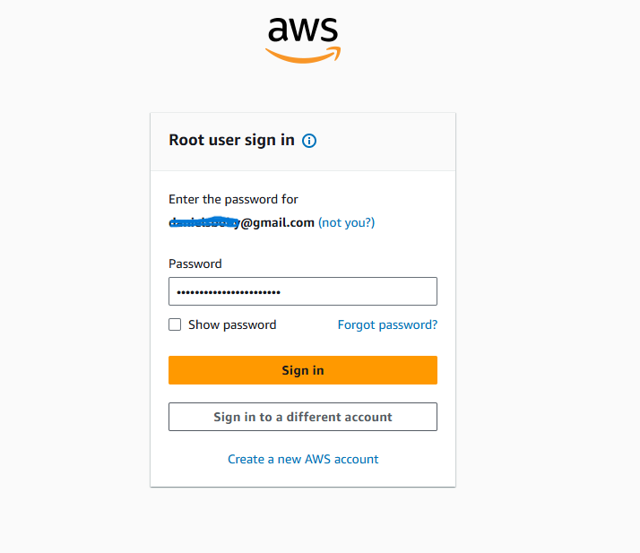
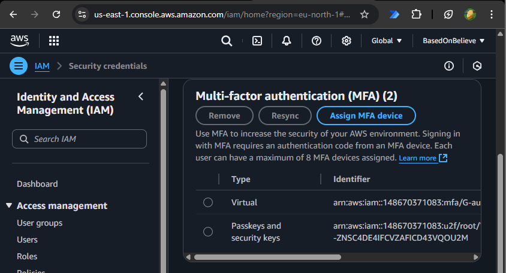
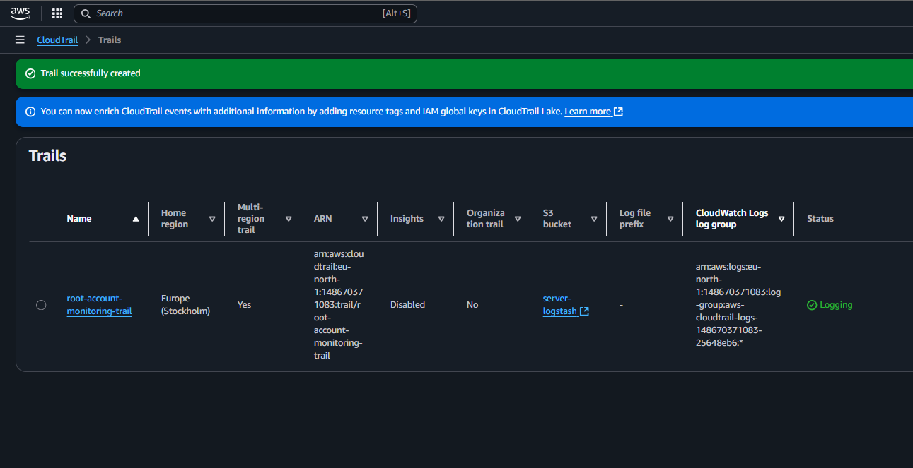
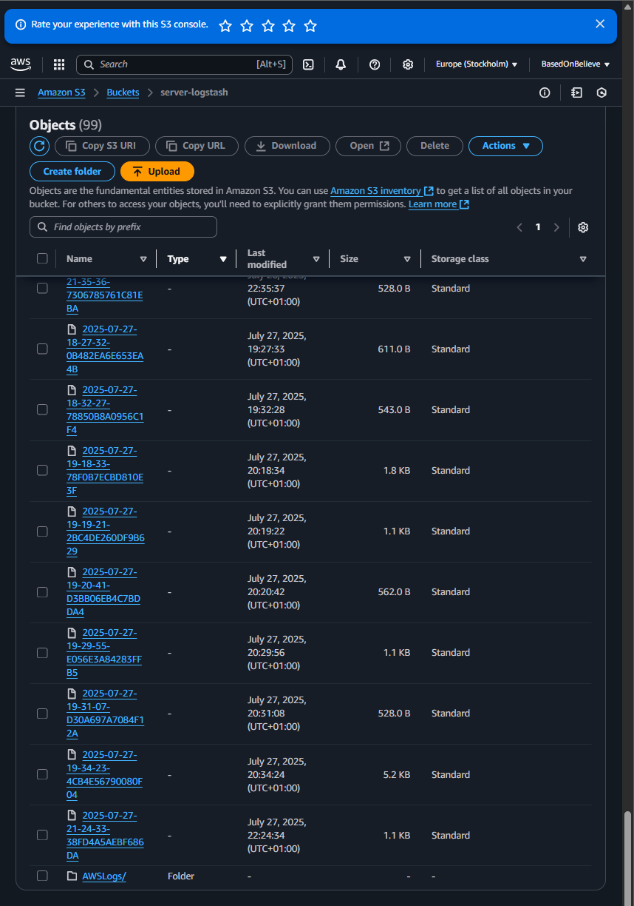
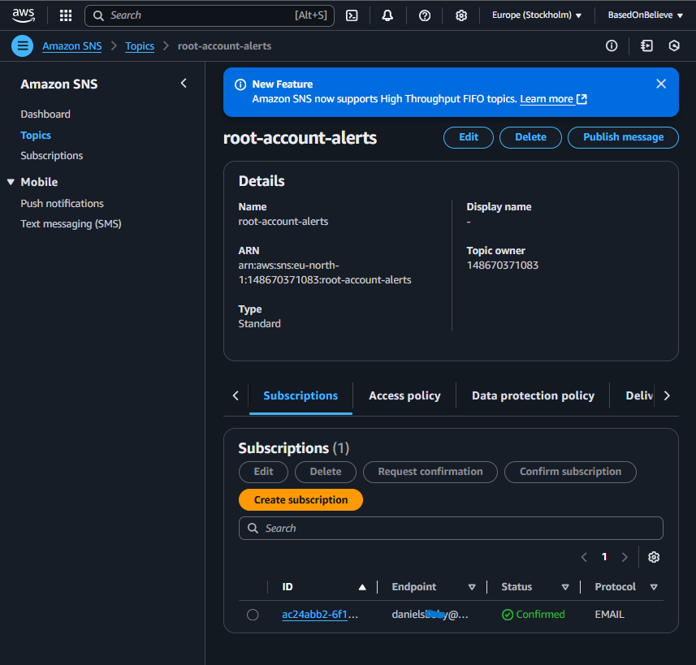
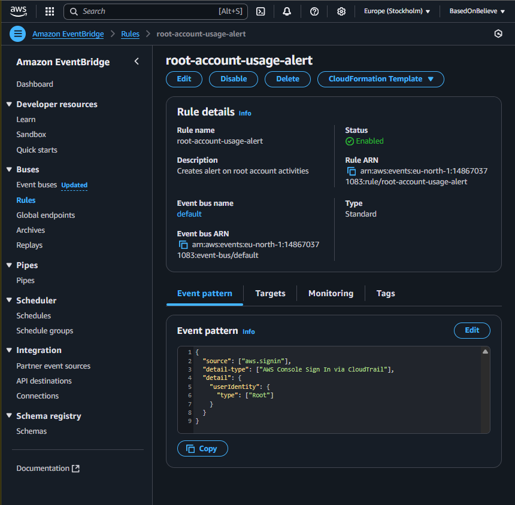
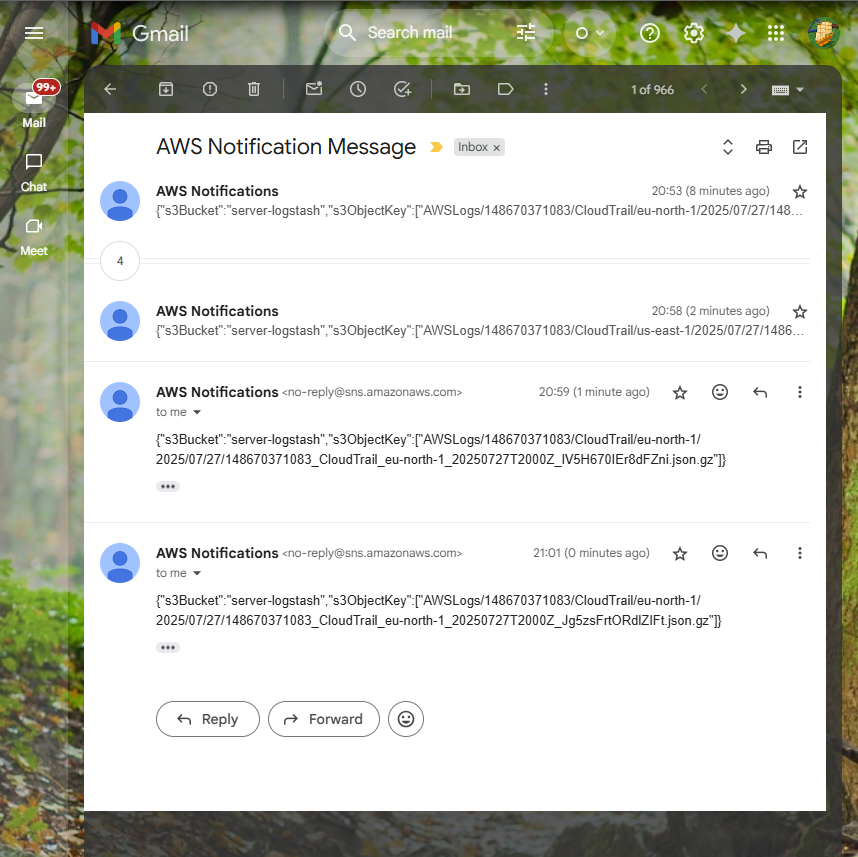

# Root Account Monitoring with CloudTrail + SNS

## 📌 Overview
This project is part of my **#100DaysOfCybersecurity Challenge**.  
The goal is to detect and respond to **AWS root account usage**, which is one of the most sensitive and high-risk actions in any AWS environment; using **CloudTrail, SNS, and EventBridge**.

---

## 🎯 Objectives

✅ Simulate sensitive activity from the AWS root account  
✅ Detect the root account login using **CloudTrail**  
✅ Trigger an **SNS alert** via **EventBridge** when the root account is used  

---

## 🛠 Tools Used

- **AWS Management Console**  
- **CloudTrail**  
- **SNS (Simple Notification Service)**  
- **EventBridge (formerly CloudWatch Events)**  
- **S3 (for storing CloudTrail logs)**  

---

## 📝 Steps & Screenshots

### **1. Log in Using the Root Account**
- Performed login using the root account for simulation.


---

### **2. Perform a Sensitive Action**
- Sensitive Action: Enabled **Multi-Factor Authentication** *(MFA)*.  
- This ensures CloudTrail logs the root account activity.  


---

### **3. Enable CloudTrail**
- Created a trail: `root-account-monitoring-trail`  
- Configured to log all **management events** to an S3 bucket `server-logstash`.  


---

### **4. Verify Logs in S3**
- Confirmed that CloudTrail logs are stored in the S3 bucket.  


---

### **5. Set Up SNS Topic & Subscription**
- **Topic:** `root-account-alerts`  
- Subscribed my email to receive alerts and confirmed the subscription.  


---

### **6. Create EventBridge Rule (Root Account Usage)**
- Created a rule: `root-account-usage-alert`  
- **Event Pattern:**

```json
{
  "source": ["aws.signin"],
  "detail-type": ["AWS Console Sign In via CloudTrail"],
  "detail": {
    "userIdentity": {
      "type": ["Root"]
    }
  }
}
```


---

### **7. Test the Setup**
- Logged in again as root
- Received SNS alert via email


---

### ✅ Verification 
- CloudTrail Logs: Confirmed root account sign-in recorded in CloudTrail.
- SNS Alert: Email received within seconds of login.

---

### 📖 What I Learned 
- Root account usage should always be monitored.
- CloudTrail + EventBridge + SNS provides near real-time alerting for sensitive actions.
- Alerts like this are essential for detecting unauthorized root account use.

---

### 🔗 Next Steps
- Extend this to monitor other sensitive activities (e.g., IAM policy changes).

---

## ✍ **Author**

👩‍💻 **Chukwu PraiseGod**  
Follow my journey: [X](https://x.com/chukwupg) | [LinkedIn](https://linkedin.com/in/chukwupg)  
